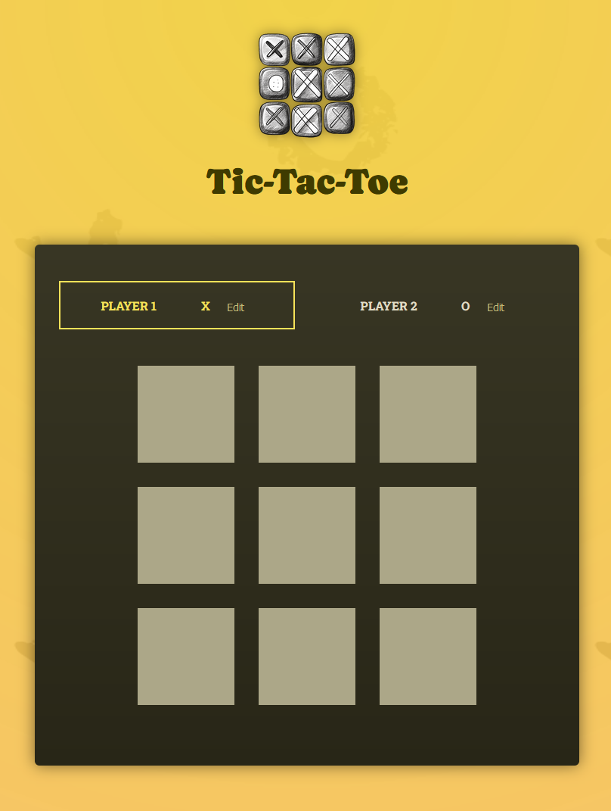

# Tic-Tac-Toe
Traditional game of Tic-Tac-Toe played directly in a web browser. This project was developed using React libraries and Vite.

## Features
- Editable player names
- Log of turns output below game board

## Pre-requisites
Ensure the following pre-requisities are installed on your machine before continuing.

- npm

## Build the Project
Follow the steps below to install dependencies, build, and run the project in your preferred shell.

1. `npm i`
2. `npm run dev`
3. Open a browser, and navigate to the URL: http://localhost:5173
